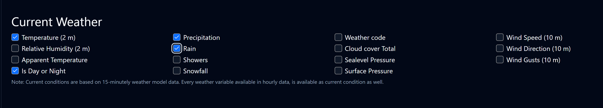

<h2 align="center">🚀 MCPs 🚀</h2>

<h3 align="center">📦 Inicializar <code>package.json</code></h3>

```bash
npm init -y
```

<h3 align="center">🛠️ SDK</h3>
https://github.com/modelcontextprotocol/typescript-sdk  

```bash
npm install @modelcontextprotocol/sdk
```

<h3 align="center">🔍 Validar entradas y salidas</h3>

```bash
npm i zod
```

<h3 align="center">⚡ Ejecutar directamente los TS</h3>

```bash
npx -y tsx main.ts
```

<h3 align="center">📁 Ruta del proyecto</h3>

```text
C:\xampp\htdocs\MCPs
```

<h3 align="center">📖 DEFINICIÓN</h3>

> **STDIO** = Standard input and output / entrada y salida estándar

<h3 align="center">🕵️‍♂️ Instalar y ejecutar Inspector</h3>

```bash
npx @modelcontextprotocol/inspector npx -y tsx main.ts
# o con -y para ejecutar sin confirmaciones
npx -y @modelcontextprotocol/inspector npx -y tsx main.ts

```

<h3 align="center">🌍 API Geocoding (LAT/LON por ciudad)</h3>
https://open-meteo.com/en/docs/geocoding-api?language=es

<h3 align="center">☁️ API Clima</h3>
https://open-meteo.com/en/docs?forecast_days=1&current=is_day,temperature_2m,precipitation,rain

<p align="center">
  
</p>
